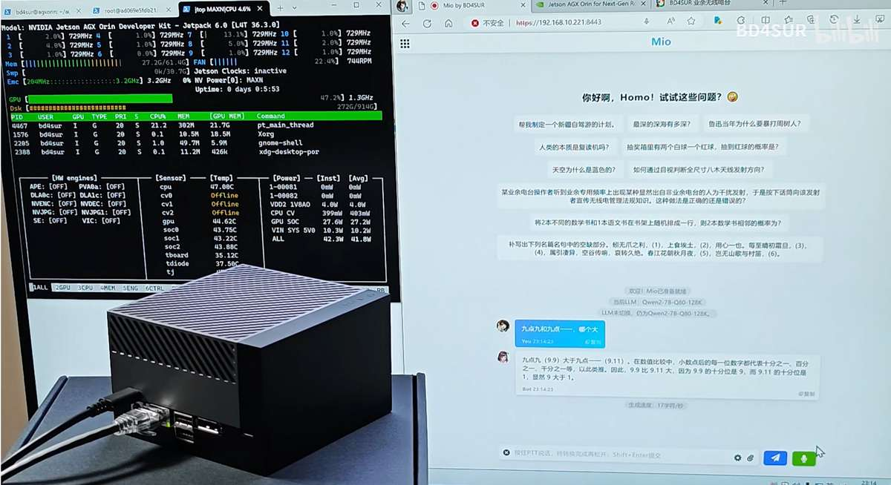

# Mio

多模态交互智能代理 Intelligent Agent with Multi-modal Interaction.

[B站演示视频：Jetson AGX Orin 部署大模型语音对话](https://www.bilibili.com/video/BV1LiYJedETE)



## 安装部署

**安装依赖**

Mio是多个LLM、VLM和TTS模型的缝合怪，各自的依赖相互冲突，因此需要做一点小小的魔改。本人主要在 Jetson AGX Orin 上开发并部署Mio，因此此处记载的信息可能并不通用。

- **PyTorch**：仅可使用[nvidia官方提供的torch、torchvision、torchaudio三件套](https://forums.developer.nvidia.com/t/pytorch-for-jetson/72048)。
- **Transformers**：Mio仅支持Qwen2-VL这一个VLM，而Qwen2-VL要求`transformers>=4.45.0`。然而，截至2024年8月31日，`transformers==4.45.0.dev0`已不能完美支持`torch<=2.3.0`。因此，需要找到`<site-packages>/transformers/pytorch_utils.py`的`ALL_LAYERNORM_LAYERS`变量，删掉列表中的`nn.RMSNorm`。
- **Flash-Attention-2**：这个东西在 Jetson AGX Orin 上编译起来非常困难，可以不用。如果一定要编译，需要注意的是：①将`setup.py`中所有涉及`sm_xx`的部分改成`sm_87`（因为Orin的 Ampere GPU 的 Compute Capability == 8.7）；②并行任务数不能高于`MAX_JOBS=6`，否则会耗尽记忆体。

```
sudo apt install ffmpeg libavformat-dev libavcodec-dev libavutil-dev libavdevice-dev libavfilter-dev

conda create -n mio python==3.11 pysocks -y
conda activate mio
cd Mio
CMAKE_ARGS="-DLLAMA_CUDA=on" python -m pip install -r requirements.txt
```

[或者单独编译llama.cpp，然后复用已有的`libllama.so`安装llama-cpp-python](https://github.com/abetlen/llama-cpp-python/issues/1070)：

```
cd /home/bd4sur/ai
git clone https://github.com/ggerganov/llama.cpp
cd llama.cpp

mkdir build
cd build
cmake .. -DBUILD_SHARED_LIBS=ON -DGGML_CUDA=ON
cmake --build . --config Release

export LLAMA_CPP_LIB=/home/bd4sur/ai/llama.cpp/build/src/libllama.so
CMAKE_ARGS="-DLLAMA_BUILD=OFF" python -m pip install llama-cpp-python
```


**生成自签名SSL证书**

**<span style="color: red;">警告：本节涉及网络安全，仅供本人技术备忘之用。读者切勿参考，否则后果自负。</span>**

由于现代浏览器的安全策略限制，必须使用HTTPS，才能在浏览器上使用语音交互。因此，在内网服务器上部署时，需要正确配置SSL证书。

1、首先生成私钥。过程中需要输入口令，必须牢记并保密该口令。

```
openssl genrsa -des3 -out key.pem 1024
```

2、在信任的环境中，将其解密为明文密钥，这样每次启动服务器或者建立SSL连接时，无需输入口令。

```
openssl rsa -in key.pem -out key_unencrypted.pem
```

3、生成CSR（证书签名请求）文件。注意：Common Name 必须与域名保持一致，否则浏览器会提示安全风险。

openssl req -new -key key_unencrypted.pem -out bd4sur.csr

4、生成自签名证书。首先在当前工作目录创建扩展配置文件`extconfig.txt`（[参考](https://www.openssl.org/docs/man3.0/man5/x509v3_config.html)），其内容如下，以添加“证书使用者可选名称”字段。如果不添加这一字段，则浏览器会提示安全风险。

```
basicConstraints = CA:FALSE
subjectAltName = @alt_names
[alt_names]
DNS.1 = ai.bd4sur.intra
```

然后执行以下命令，生成自签名证书`bd4sur.crt`，其有效期为365天。

```
openssl x509 -req -days 365 -in bd4sur.csr -signkey key_unencrypted.pem -out bd4sur.crt -extfile extconfig.txt
```

5、将私钥文件`key_unencrypted.pem`和证书文件`bd4sur.crt`置于以下目录：

- `~`
- `~/ai/funasr/models` 用于FunASR容器通过挂载的目录访问。

6、将证书设置为客户端的信任证书。对于安卓（小米）手机，通过“设置→密码与安全→系统安全→加密与凭据→从存储设备安装”，选取上面生成的`bd4sur.crt`，验证身份后，“凭据用途”选择“VPN和应用”即可。

7、在手机上设置域名解析。在内网搭建DNS服务器之前，以下是一个权宜手段：手机安装[Virtual-Hosts](https://github.com/x-falcon/Virtual-Hosts)，设置hosts文件并启动。

**创建并进入虚拟环境，安装相关依赖**

```
conda create -n mio python=3.10.15 pysocks -y

conda activate mio
pip install -r requirements.txt
```

**启动FunASR容器**

```
bash start_funasr.sh
```

NOTE 设置无需`sudo`执行`docker run`：

```
# 添加docker用户组
sudo groupadd docker

# 将添加当前用户到docker用户组
sudo gpasswd -a ${USER} docker

# 重启docker服务
sudo service docker restart

# 给docker.sock增加读写权限
sudo chmod a+rw /var/run/docker.sock
```

**启动LLM服务器**

```
python server.py
```

**访问**

在浏览器中输入`https://ai.bd4sur.intra:8443`，进入对话窗口。

**注意事项**

- 默认关闭自动TTS功能。可以点击输入框旁边的喇叭图标，开启自动TTS功能。由于ChatTTS对硬件性能要求很高，在Jetson上还不能实现实时TTS，因此需要等待比较长的时间才能听到转换后的语音。
- 视觉问答目前只支持针对一幅图片的连续问答。
- 选用纯语言模型时，不要上传图片，否则可能会出错。

## 权利声明

版权所有 © 2024 BD4SUR，保留所有权利。

本系统“按原样”提供，采用MIT协议授权。本系统为作者个人以学习和自用目的所创作的作品。作者不对本系统的质量作任何承诺。作者不保证提供有关本系统的任何形式的解释、维护或支持。作者不为任何人使用此系统所造成的任何正面的或负面的后果负责。

**以部分或全部代码形式集成的开源软件**

- [ChatTTS](https://github.com/2noise/ChatTTS)
- [FunASR](https://github.com/alibaba-damo-academy/FunASR)
- [jQuery](https://jquery.org/license)
- [Socket.IO](https://github.com/socketio/socket.io)
- [marked.js](https://github.com/markedjs/marked)
- [MathJax](https://github.com/mathjax/MathJax)
